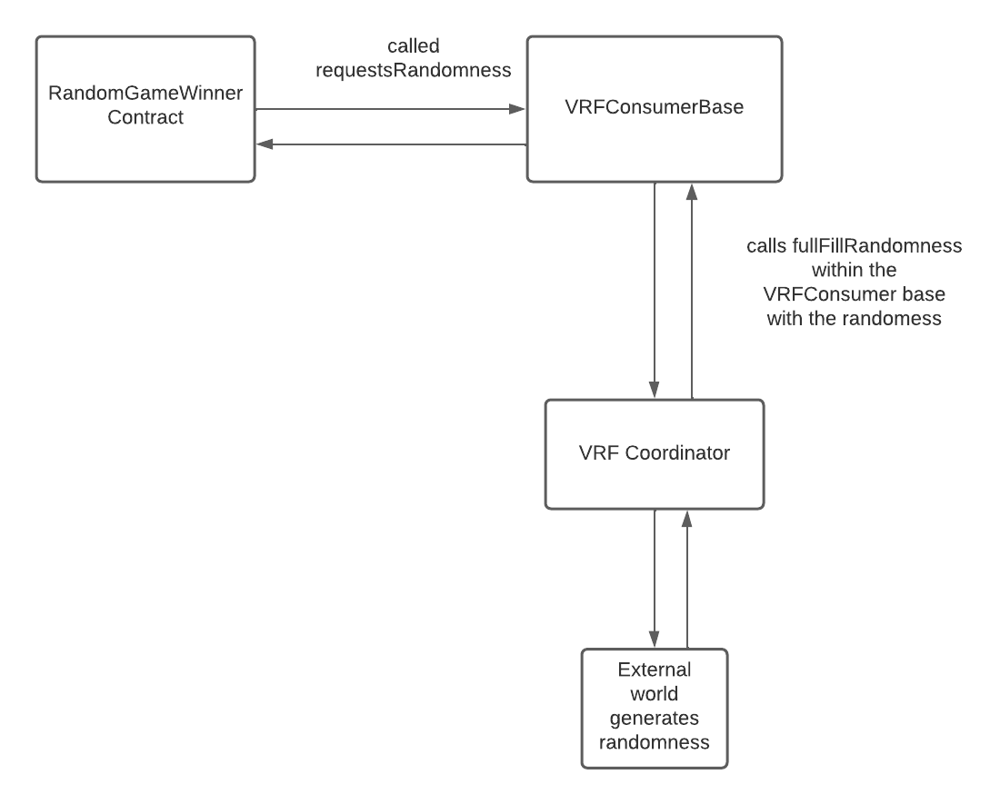

<h1 aling="center">Chainlink VRF 👷‍♂️⛓</h1>

  <a href="https://github.com/maurodesouza/profile-readme-generator/blob/master/LICENSE.md" target="_blank">
    
  </a>

  <a href="#" target="_blank">
    
  </a>

  <a href="#" target="_blank">
    
  </a>

  <a href="https://github.com/gab0071" target="_blank">
    
  </a>
 

  <br>
  <br>

When dealing with computers, randomness is an important but difficult issue to handle due to a computer's deterministic nature. This is true even more so when speaking of blockchain because not only is the computer deterministic, but it is also transparent. As a result, trusted random numbers cannot be generated natively in Solidity because randomness will be calculated on-chain which is public info to all the miners and the users.

So we can use some web2 technologies to generate the randomness and then use them on-chain.

<h2> What is an oracle? </h2>

- An oracle sends data from the outside world to a blockchain's smart contract and vice-verca. 
- Smart contract can then use this data to make a decision and change its state.
- They act as bridges between blockchains and the external world.
- However it is important to note that the blockchain oracle is not itself the data source but its job is to query, verify and authenticate the outside data and then futher pass it to the smart contract.

Today we will learn about one of oracles named Chainlink VRF's

Lets goo 🚀

<h2> Intro </h2>

- Chainlink VRF's are oracles which used to generate random values. 
- These values are verified using cryptographic proofs.
- These proofs prove that the results weren't tampered or manipulated by oracle operators, users, miners etc.
- Proofs are published on-chain so that they can be verified.
- After there verification is successful they are used by smart contracts which requested randomness.

The official Chainlink Docs describe VRFs as:

> Chainlink VRF (Verifiable Random Function) is a provably-fair and verifiable source of randomness designed for smart contracts. Smart contract developers can use Chainlink VRF as a tamper-proof random number generator (RNG) to build reliable smart contracts for any applications which rely on unpredictable outcomes.



- If you look at the diagram you can understand the flow, `RandomGameWinner` contract will inherit the `VRFConsumerBase` contract and will call the `requestRandomness` function within the `VRFConsumerBase`. 
- On calling that function the request to randomness starts and the `VRFConsumerBase` further calls the `VRFCoordinator` contract which is reponsible for getting the randomness back from the external world.
- After the `VRFCoordinator` has the randomness it calls the `fullFillRandomness` function within the `VRFConsumerBase` which further then selects the winner.
- **Note the important part is that eventhough you called the `requestRandomness` function you get the randomness back in the `fullFillRandomness` function**

<h2> Requirements </h2>

- We will build a lottery game today
- Each game will have a max number of players and an entry fee
- After max number of players have entered the game, one winner is chosen at random
- The winner will get `maxplayers*entryfee` amount of ether for winning the game


You can see the smart contract on Polygonscan: <a href="https://mumbai.polygonscan.com/address/0xb877ac7a087abe5014a5164f7e0217b6819241ff">Project</a>.

🚨 Note: Remember to put your polygonScan API in your `.env` file, as there is a script in `scripts/deploy.js` to instantly verify our smart contract after it is deployed.

<hr>
<h2> Installing / Getting started </h2>

```bash
# Clone this project
$ git clone https://github.com/gab0071/Lottery-chainlinkVRF

# Access
$ cd Lottery-chainlinkVRF

# Install dependencies
$ npm install

``` 

<h2>Commands</h2>

- $ ` npx hardhat compile `
- $ ` npx hardhat run scripts/deploy.js --network mumbai`

<h2> Technologies / Built With </h2>

- Solidity
- Metamask
- <a href="https://www.npmjs.com/package/@openzeppelin/contracts"> OpenZeppelin </a>
- <a href="https://hardhat.org/">Hardhat Framework</a>
- <a href="https://polygonscan.com/login">Polygonscan</a>
- <a href="https://faucets.chain.link/">Chainlink Faucet</a>


<h2>License</h2>

<p>This project is under license from MIT. For more details, see the LICENSE file.</p>

<h2>Contributing</h2>
Contributions are always welcome! Open a PR or an issue!

<br>
<br>

<p align="center">
<br/>
  Made with ❤️ by <b>catellaTech</b>.
<p/>